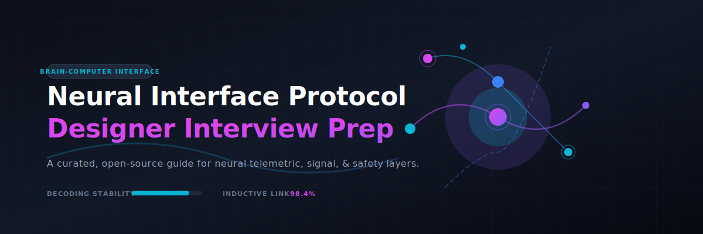

  

  
  
  
  
  

# 🧠 Neural Interface Protocol Designer — Interview Questions ⚡

> 🔍 **Keywords:** Neural Interface, Protocol Designer, Brain-Computer Interface (BCI), Neural Telemetry, Signal Processing, Neural Implant, Medical Device Safety, Neurotechnology Interview Prep.

A curated, open-source collection of interview questions (with answers) for **Neural Interface Protocol Designer** roles — the engineers who design the communication, signal, and safety layers between the brain (or peripheral nervous system) and external hardware/software in brain-computer interface (BCI) and neural implant systems. 🔌

This role sits at the intersection of **neuroscience, embedded systems, wireless/wired protocol design, signal processing, and medical device safety**. The questions here reflect that breadth — from "how do you decode a motor cortex spike train" to "how do you design a fail-safe telemetry link for an implanted device." 🛰️

> ⚠️ **Disclaimer:** This is a community knowledge base, not a certification or an official curriculum. Answers aim to be technically sound and interview-appropriate (concise, structured, demonstrating reasoning) — not exhaustive textbook chapters. Always verify against current literature/standards for anything safety-critical.

---

## 📚 Contents

| # | Category | File | Approx. Questions |
|---|----------|------|--------------------|
| 1 | 🧬 Neuroscience & Signal Fundamentals | [`questions/01-neuroscience-signal-fundamentals.md`](questions/01-neuroscience-signal-fundamentals.md) | 20 |
| 2 | 📊 Signal Processing & Decoding | [`questions/02-signal-processing-decoding.md`](questions/02-signal-processing-decoding.md) | 20 |
| 3 | 📡 Protocol & Communication Design | [`questions/03-protocol-communication-design.md`](questions/03-protocol-communication-design.md) | 22 |
| 4 | 📟 Embedded Systems & Hardware Interfacing | [`questions/04-embedded-systems-hardware.md`](questions/04-embedded-systems-hardware.md) | 20 |
| 5 | ⚡ Power, Wireless & RF Design | [`questions/05-power-wireless-rf.md`](questions/05-power-wireless-rf.md) | 18 |
| 6 | 🛡️ Safety, Reliability & Fault Tolerance | [`questions/06-safety-reliability-fault-tolerance.md`](questions/06-safety-reliability-fault-tolerance.md) | 20 |
| 7 | ⚖️ Regulatory, Ethics & Standards | [`questions/07-regulatory-ethics-standards.md`](questions/07-regulatory-ethics-standards.md) | 18 |
| 8 | 🔒 Security & Data Privacy | [`questions/08-security-data-privacy.md`](questions/08-security-data-privacy.md) | 18 |
| 9 | 💻 Software, Firmware & Systems Architecture | [`questions/09-software-firmware-architecture.md`](questions/09-software-firmware-architecture.md) | 20 |
| 10 | 🗺️ System Design / Case Study Questions | [`questions/10-system-design-case-studies.md`](questions/10-system-design-case-studies.md) | 12 |
| 11 | 🤝 Behavioral & Cross-Functional | [`questions/11-behavioral-cross-functional.md`](questions/11-behavioral-cross-functional.md) | 15 |

**✨ Total: ~200+ questions with answers. ✨**

---

## 🧭 How to use this repo

- **Candidates:** 🎯 Work through categories in order (1→2→3 builds foundational-to-applied). Category 10 (system design) is where interviews are usually won or lost for senior roles — don't skip it!
- **Interviewers:** 🛠️ Pick 1–2 questions per category rather than testing every category in one loop. Mix a fundamentals question with an open-ended system design question to see both depth and judgment.
- **Everyone:** 💡 Answers are written to show *reasoning*, not just facts — that's what's actually being evaluated in most interviews for this role.

## 🗂️ Difficulty tags

Each question is tagged:
- 🟢 **Foundational** — expected of any candidate
- 🟡 **Intermediate** — mid-level / role-specific depth
- 🔴 **Advanced** — senior/staff-level, open-ended, or research-adjacent

## 🤝 Contributing

Contributions are very welcome — this field moves fast and no single person covers all of it. See [`CONTRIBUTING.md`](CONTRIBUTING.md) for guidelines on adding questions, improving answers, or fixing errors. 🚀

## 📄 License

Content licensed under [CC BY-SA 4.0](LICENSE) — free to use and adapt, with attribution, sharing improvements back under the same license. ⚖️

